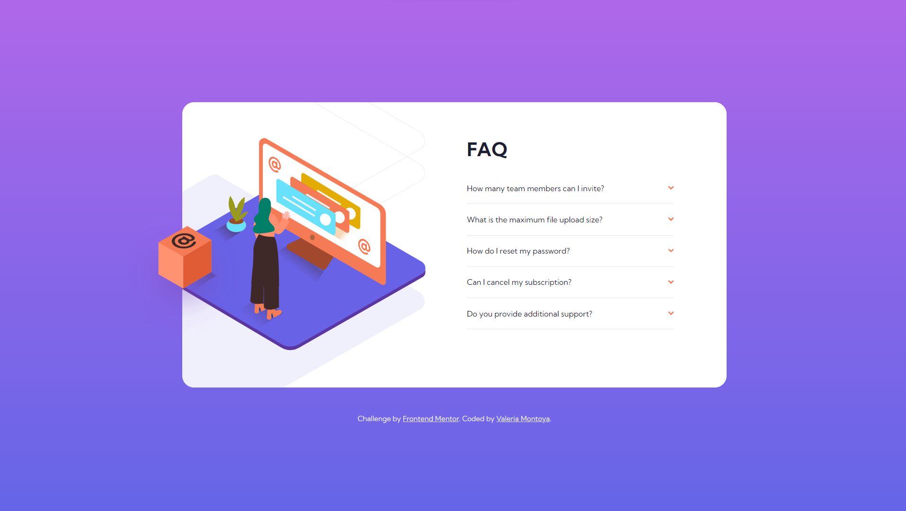

# Frontend Mentor - FAQ accordion card solution

This is a solution to the [FAQ accordion card challenge on Frontend Mentor](https://www.frontendmentor.io/challenges/faq-accordion-card-XlyjD0Oam). Frontend Mentor challenges help you improve your coding skills by building realistic projects.

## Table of contents

- [Overview](#overview)
  - [The challenge](#the-challenge)
  - [Screenshot](#screenshot)
  - [Links](#links)
- [My process](#my-process)
  - [Built with](#built-with)
  - [What I learned](#what-i-learned)
- [Author](#author)

## Overview

### The challenge

Users should be able to:

- View the optimal layout for the component depending on their device's screen size
- See hover states for all interactive elements on the page
- Hide/Show the answer to a question when the question is clicked

### Screenshot



### Links

- Solution URL: [GitHub Repository](https://github.com/ValeriaMontoya/faq-accordion-card)
- Live Site URL: [GitHub Pages](https://valeriamontoya.github.io/faq-accordion-card/)

## My process

### Built with

- Semantic HTML5 markup
- CSS custom properties
- Flexbox
- Mobile-first workflow
- BEM methodology

### What I learned

The main thing I learned from this challenge is to work with JavaScript and give more interactivity to the page.

Here's my JavaScript code:

```js
const accordionItems = document.querySelectorAll(".faq__list__item");

for (let item of accordionItems) {
  item.addEventListener("click", handleAccordion);
}

function handleAccordion(i) {
  const listItem = i.currentTarget;

  const question = listItem.querySelector(".faq__list__question--text");
  question.classList.toggle("faq__list__question--selected");

  const answer = listItem.querySelector(".faq__list__answer");
  answer.classList.toggle("faq__list__answer--hidden");

  const arrow = listItem.querySelector(".faq__list__question--icon");
  arrow.classList.toggle("faq__list__question--rotated-icon");
}
```

## Author

- Frontend Mentor - [@ValeriaMontoya](https://www.frontendmentor.io/profile/ValeriaMontoya)
- Twitter - [@vale_montoya\_](https://twitter.com/vale_montoya_)
